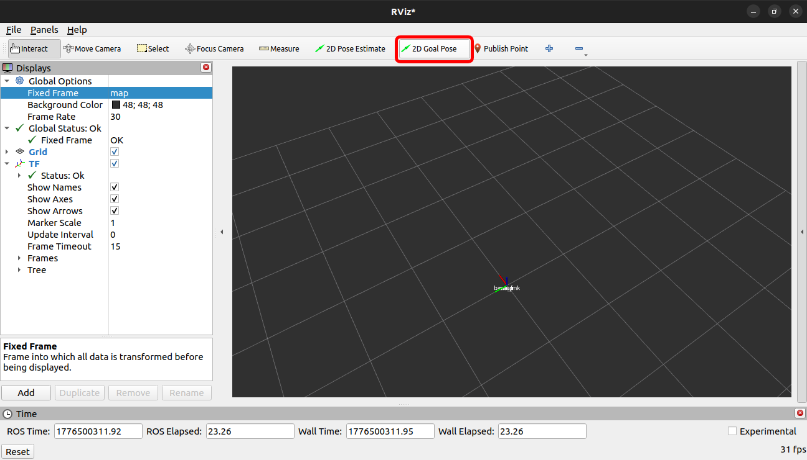

## TheDush Robotics Task

### Task 1

Published the tf for:

```
base_link -> odom -> map
```

#### Steps to run:

In terminal 1, Runing the Static Transform for Odom -> Base_link

```bash
ros2 run tf2_ros static_transform_publisher \
  --x 0 --y 0 --z 0 \
  --roll 0 --pitch 0 --yaw 0 \
  --frame-id odom \
  --child-frame-id base_link
```

In terminal 2, Runing the ROS2 node for tf frames.

``` bash
ros2 run task_tf frame_management
```

In terminal 3, Running the Rviz for frame visualization.
``` bash
rviz2
```



Attached the Output [video here](./task_tf/video/Task_1_Tf_Management.mp4)

### Task 2

Implemented the custom controller plugin for robot navigation.

#### Steps to run:

In terminal 1, Running the turtlebot3 with the gazebo environment.

``` bash
export TURTLEBOT3_MODEL=burger
ros2 launch turtlebot3_gazebo turtlebot3_world.launch.py
```

In terminal 2, Running the turtlebot3 navigation interface with the custom plugin in it.

``` bash
export TURTLEBOT3_MODEL=burger
ros2 launch turtlebot3_navigation2 navigation2.launch.py use_sim_time:=True
```

Attached the output [video here](./task_plugins/video/Task_2_Controller_Plugin.mp4).

### Task 3

Implemented docking using both Service-based & Action-based approaches.

#### Steps to run:

##### Service Based Approach

In terminal 1, Running the server node for the Service based approach.

``` bash
ros2 run task_dock docking_server 
```

In terminal 2, Running the client node for the Service based approach.

``` bash
ros2 run task_dock robot_client
```
Attached the Output [video here](./task_dock/video/Task_3_Docking_Service_Based.mp4).

##### Action Based Approach

In terminal 1, Running the action server node for the Action based approach.

``` bash
ros2 run task_dock docking_action_server
```

In terminal 2, Running the action client node for the Action Based approach.

``` bash
ros2 run task_dock robot_action_client
```

Attached the Output [video here](./task_dock/video/Task_3_Docking_Action_based.mp4).

## Demo Videos

- [Task 1: TF Visualization](./task_tf/video/Task_1_Tf_Management.mp4)
- [Task 2: Navigation Plugin](./task_plugins/video/Task_2_Controller_Plugin.mp4)
- [Task 3: Docking (Service)](./task_dock/video/Task_3_Docking_Service_Based.mp4)
- [Task 3: Docking (Action)](./task_dock/video/Task_3_Docking_Action_based.mp4)

## Author

Pon Dinesh S  
M.Tech Robotics & Automation  
Senior ROS Developer
